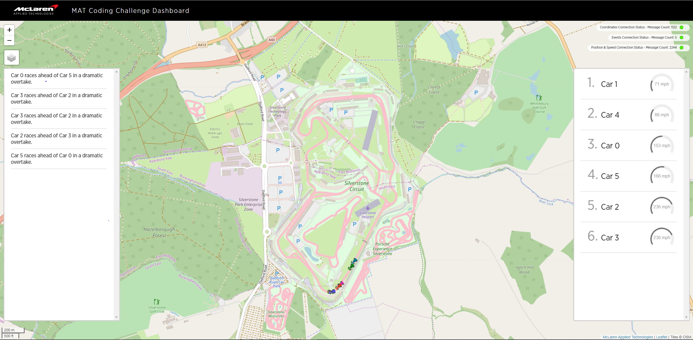

# MAT Coding Challenge Submission - David Vella

## Prerequisites:

* [docker](https://docs.docker.com/)
* [docker-compose](https://docs.docker.com/compose/)

## Introduction

The purpose of this challenge was to write a backend application to parse and transform streamed telemetry data of F1 cars at Silverstone.  A basic front-end application had been developed to visualize Formula 1 cars going around a track driven by raw telemetry data via [MQTT](http://mqtt.org/). As part of the task we developed a data processing application which subscribes to the provided MQTT broker and consumes data from the following MQTT topic and replies with a topic with more information. This project is my submission. More information about the original task can be found here : [https://github.com/McLarenAppliedTechnologies/MAT-Coding-Challenge](https://github.com/McLarenAppliedTechnologies/MAT-Coding-Challenge) 

## Getting started

My application has been developed as a docker container which can be found here: [https://hub.docker.com/repository/docker/davidvella/mat.coding.challenge](https://hub.docker.com/repository/docker/davidvella/mat.coding.challenge)

To start all components:

```console
$ docker-compose pull
$ docker-compose up -d
Starting broker ... done
Starting carcoordinateapp  ... done
Starting mqtt-to-websocket ... done
Starting source_gps        ... done
Starting webapp            ... done

```

Open (http://localhost:8084)

Test the setup with `mosquitto_pub` or a similar MQTT client:

```console
$ mosquitto_pub -t events -f examples/event.json
$ mosquitto_pub -t carStatus -f examples/position.json
$ mosquitto_pub -t carStatus -f examples/speed.json
```

You should now see multiple car's position, speed and an event stream on the webapp. Example is below:


# Writeup
## Explanation
This submission is a .NET Core 3.1 application which is running in a docker container. More information on .NET Core and docker can be found [online](https://docs.microsoft.com/en-us/dotnet/core/docker/introduction).

Data is streamed from a centralized MQTT Broker. The broker allows a consumer to subscribe to the 'carCoordinate' topic which looks something like this:
```json
      {
        timestamp: number,
        carIndex: number,
        location: {
          lat: float,
          long: float
         }
      }
```
The data provided include the cars id (carIndex), timestamp ([UnixTime](https://en.wikipedia.org/wiki/Unix_time)) and location in latitude and longitude. What this effectively allows us to do is to calculate the car's speed my tracking their gps location over time. The [Haversine Formula](https://en.wikipedia.org/wiki/Haversine_formula) is used to calculate the great-circle distance between two points – that is, the shortest distance over the earth’s surface – giving an ‘as-the-crow-flies’ distance between the points. .Net has a prebuilt implementation of this using a class called [GeoCoordinate](https://docs.microsoft.com/en-us/dotnet/api/system.device.location.geocoordinate?view=netframework-4.8) which is what I used for the project. This GetDistanceTo method returns Returns the distance between the latitude and longitude coordinates that are specified by this [GeoCoordinate](https://docs.microsoft.com/en-us/dotnet/api/system.device.location.geocoordinate?view=netframework-4.8) and another specified [GeoCoordinate](https://docs.microsoft.com/en-us/dotnet/api/system.device.location.geocoordinate?view=netframework-4.8) in meters. 


Using the equation for speed:

  
As we already had the timestamp we could use two 'carCoordinate' topics to track the car's speed over the change in time. To track drivers over time the driver's information is stored inside a cache. Specifically a dictionary where the key is driver's car index and the value is it's information. Rather than persisting this data in a permanent data store. For this project a dictionary is used inside the processor which is a singleton. ASP.net provides the service instance the first time it is requested. After that every subsequent request will use the same instance. This is managed with [dependency injection](https://docs.microsoft.com/en-us/aspnet/core/mvc/controllers/dependency-injection?view=aspnetcore-3.1). 

In F1, a race the length of the race must be 305 km (260 km in case of Monaco GP) and is defined as "the smallest number of complete laps that exceeds 305 kilometers". The number of laps in a race is obtained by dividing 305 by the length of a lap, which differs from track to track. The duration of the race cannot be more than 2 hours. If the allocated time of 2 hours is exceeded, the race is considered to be finished at the end of the ongoing lap.

Therefore, to calculate the driver's race position we order the drivers based on the furthest distance traveled. This 'total distance' was calculated using the accumulation of GPS coordinate distances using the same output from the formula earlier. Each event the current driver is compared against the total of the others drivers to calculate his position. We also use this to calculate if the drivers position has changed and publish an event when it occurs.

## Tests
Units Test have been written and are included in the test project. However, more test could have been written but the MQTT client used did not allow fakes to be written which hindered testing.
```console
Extension methods (here: ManagedMqttClientExtensions.PublishAsync) may not be used in setup / verification expressions.
```
## Retrospective
I feel this project shows that I can deliver the purpose of this challenge. However, if I had more spare time I feel there is more changes that need to be made to solve some of the flaws of this application:

This application would not work in scenarios where multiple consumers were needed. When a topic is consumed and there are multiple consumers in the same group. Necessary data would be missed by individual consumers causing invalid speeds / positions to be returned back to the broker. 

Also in this solution the correct position of the drivers can only be trusted if the data had been collected from the beginning. If application was to start half way through the race. Then the driver position will be incorrect. Also if there is an error in the systems which requires a restart this application would not be able to resume where it left off.

To fix this data would need to be stored in a centralized location (kafka). An application would push data from the MQTT broker into Kafka. Then other kafka consumers can pull data at their own pace, without overwhelming the source or getting overwhelmed by the source.

This design is talked about in more detail [here](https://www.confluent.io/blog/iot-with-kafka-connect-mqtt-and-rest-proxy/).

